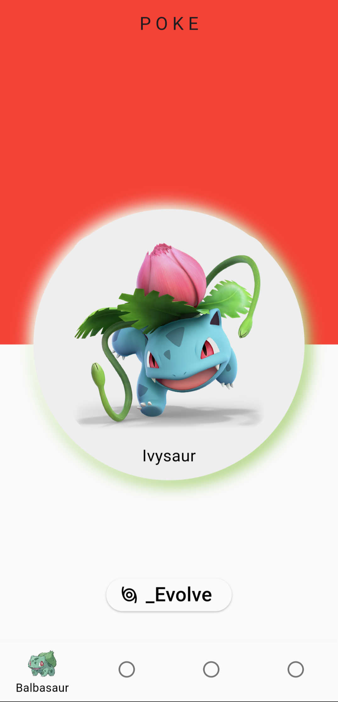
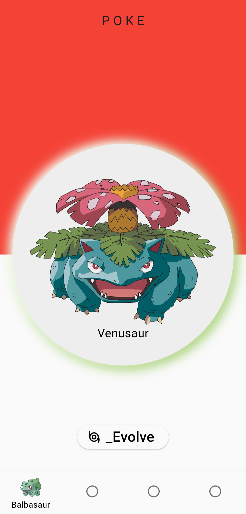
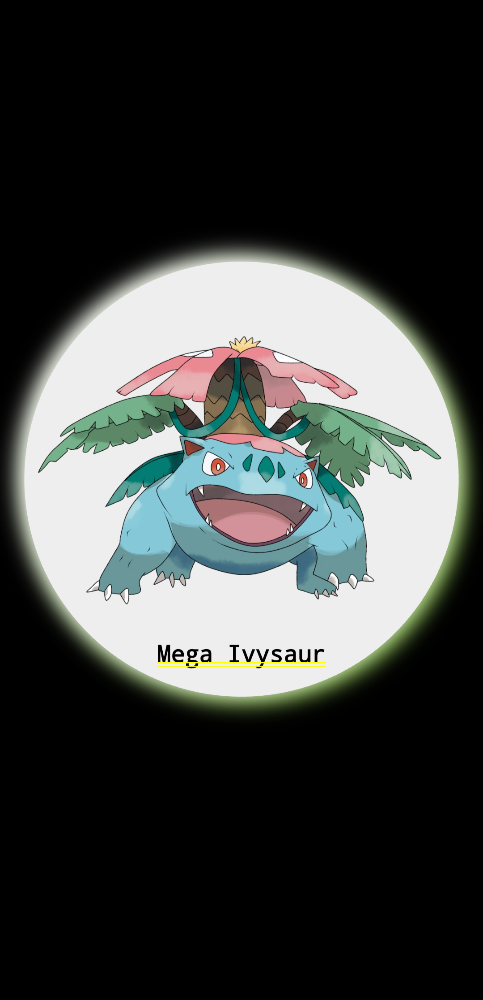
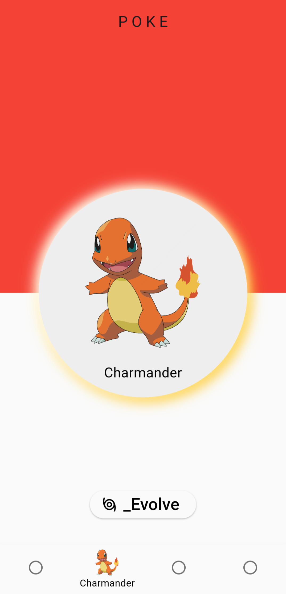
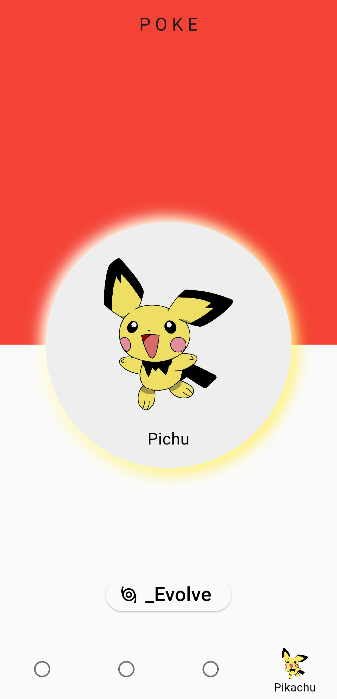

# 🐾 Poke App  

A **Flutter-based Pokémon App** that lets you explore and interact with your favorite Pokémon!  
Switch between **Bulbasaur, Charmander, Squirtle, and Pikachu**, view their **3-stage evolutions**, and unlock **special Mega Evolutions** with just a tap.  

---

## ✨ Features  
- 🎴 Interactive Pokémon cards  
- 🔄 Tap to switch between different evolution stages  
- ⚡ Special Mega Evolution screen for each Pokémon  
- 📱 Clean and responsive Flutter UI  
- 🎨 Uses reusable custom widgets for better design  

---

## 📂 Project Structure  
```plaintext
lib/
├── main.dart # Entry point of the app
├── homepage.dart # Home screen with navigation & evolve button
├── cards/ # Pokémon evolution cards
│ ├── first_card.dart
│ ├── second_card.dart
│ ├── third_card.dart
│ ├── fourth_card.dart
│ ├── first_card/ # Bulbasaur family
│ │ ├── first_card_one.dart
│ │ ├── first_card_two.dart
│ │ ├── first_card_three.dart
│ │ └── first_card_special.dart # Mega Evolution
│ ├── second_card/ # Charmander family
│ │ ├── second_card_one.dart
│ │ ├── second_card_two.dart
│ │ ├── second_card_three.dart
│ │ └── second_card_special.dart
│ ├── third_card/ # Squirtle family
│ │ ├── third_card_one.dart
│ │ ├── third_card_two.dart
│ │ ├── third_card_three.dart
│ │ └── third_card_special.dart
│ └── fourth_card/ # Pikachu family
│ ├── fourth_card_one.dart
│ ├── fourth_card_two.dart
│ ├── fourth_card_three.dart
│ └── fourth_card_special.dart
├── reused_widgets/ # Reusable UI components
│ ├── rounded_container_one.dart
│ ├── rounded_container_two.dart
│ ├── rounded_container_three.dart
│ └── rounded_container_special.dart
```

---

## 📸 Screenshots / Demo  

Here are some previews of the Poke App in action:  

| Home Screen | Bulbasaur Evolutions | Bulbasaur Evolutions |
|-------------|----------------------|----------------------|
|  |  |  |

| Mega Evolution Example | Charmander Evolutions | Squirtle Example |
|-------------------------|-----------------------|------------------|
|  |  |  |

| Pichu Evolutions |
|------------------|
|  |


---

## 🛠️ Built With  
- [Flutter](https://flutter.dev/)  
- [Dart](https://dart.dev/)  

---

## 🚀 Getting Started  

### Prerequisites  
- Install [Flutter SDK](https://docs.flutter.dev/get-started/install)  
- A code editor (VS Code / Android Studio)  

### Run the App  
```bash
flutter pub get
flutter run
